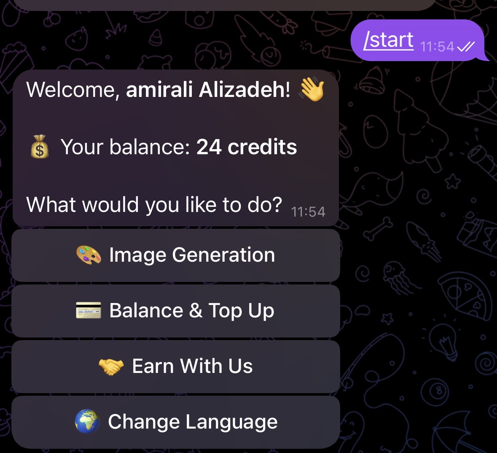
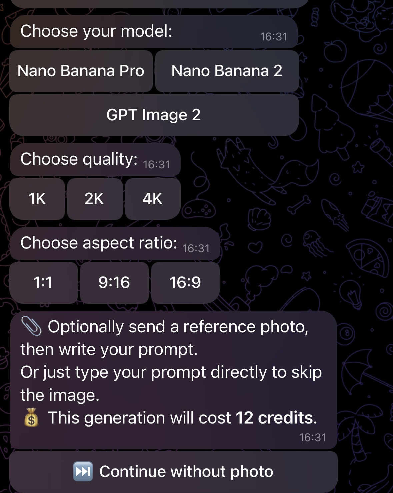
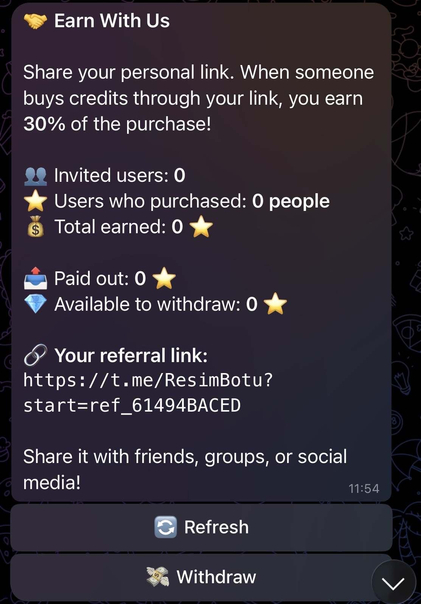

# 🍌 Nano Banana Bot

A Telegram bot for AI image generation powered by KieAI, built with Python and aiogram. Includes a credit system, Telegram Stars payments, a referral/affiliate program, and multilingual support, deployed on Railway.
## Screenshots

| Welcome menu | Image generation flow |
|---|---|
|  |  |

| Referral program | Language selection |
|---|---|
|  |  |
## Features

- 🎨 **Three AI Models** — Nano Banana Pro, Nano Banana 2, and GPT Image 2
- 📐 **Quality Options** — 1K, 2K, 4K resolution
- 🖼️ **Aspect Ratios** — 1:1, 9:16, 16:9
- 📎 **Image + Prompt** — Upload a reference photo alongside a text prompt
- 💳 **Credit System** — Users start with 30 free credits, top up via Telegram Stars
- 🤝 **Referral Program** — Users get a unique referral link and earn 30% of the Stars spent by anyone they invite, with earnings/payout tracking and manual withdrawal via operator contact
- 🌍 **Multilingual** — Turkish, English, Russian, and Persian UI with per-user language preference
- 🔁 **Repeat Generation** — Regenerate instantly with the same settings
- 📊 **Generation History** — All generations logged to PostgreSQL

## Tech Stack

| Layer | Technology |
|---|---|
| Bot Framework | aiogram 3.x |
| Language | Python 3.12 |
| Database | PostgreSQL via Supabase (asyncpg) |
| Hosting | Railway |
| Image Generation | KieAI API |
| Payments | Telegram Stars (XTR) |

## Project Structure

```
nanobanana-bot/
├── handlers/
│   ├── start.py        # /start, language toggle, main menu, referral capture
│   ├── generate.py     # Image generation FSM flow
│   ├── payment.py      # Telegram Stars payment handling
│   └── affiliate.py    # Referral link, stats, withdrawal flow
├── bot.py              # Entry point
├── config.py           # Environment variable loading & validation
├── db.py               # Core database layer (users, generations)
├── db_referral.py      # Referral code generation, stats, reward processing
├── keyboards.py        # Inline keyboards
├── states.py           # FSM states
├── texts.py            # TR / EN / RU / FA translations
├── requirements.txt
└── railway.toml
```

## Setup

### 1. Clone

```bash
git clone https://github.com/amiralialzd/telegram_bot.git
cd telegram_bot
```

### 2. Create a `.env` file

```
BOT_TOKEN=your_telegram_bot_token
BOT_USERNAME=your_bot_username_without_at
DATABASE_URL=your_supabase_connection_string
KIE_API_KEY=your_kieai_api_key
```

### 3. Create the database tables

Run in the Supabase SQL Editor:

```sql
CREATE TABLE IF NOT EXISTS users (
    id                  BIGSERIAL PRIMARY KEY,
    telegram_id         BIGINT UNIQUE NOT NULL,
    full_name           TEXT,
    username            TEXT,
    credits             INTEGER NOT NULL DEFAULT 30,
    language            TEXT NOT NULL DEFAULT 'tr',
    referral_code       TEXT UNIQUE,
    referred_by         TEXT,
    referral_earnings   INTEGER NOT NULL DEFAULT 0,
    referral_paid_out   INTEGER NOT NULL DEFAULT 0,
    created_at          TIMESTAMPTZ NOT NULL DEFAULT NOW()
);

CREATE TABLE IF NOT EXISTS generations (
    id            BIGSERIAL PRIMARY KEY,
    telegram_id   BIGINT NOT NULL REFERENCES users(telegram_id),
    model         TEXT NOT NULL,
    quality       TEXT NOT NULL,
    ratio         TEXT NOT NULL,
    prompt        TEXT NOT NULL,
    credits_spent INTEGER NOT NULL,
    created_at    TIMESTAMPTZ NOT NULL DEFAULT NOW()
);

CREATE TABLE IF NOT EXISTS referral_purchases (
    id            BIGSERIAL PRIMARY KEY,
    referrer_id   BIGINT NOT NULL REFERENCES users(telegram_id),
    buyer_id      BIGINT NOT NULL REFERENCES users(telegram_id),
    stars_paid    INTEGER NOT NULL,
    reward_stars  INTEGER NOT NULL,
    created_at    TIMESTAMPTZ NOT NULL DEFAULT NOW()
);

CREATE INDEX IF NOT EXISTS idx_generations_telegram_id ON generations(telegram_id);
CREATE INDEX IF NOT EXISTS idx_referral_purchases_referrer ON referral_purchases(referrer_id);
```

> **Verify against your live database.** This schema is reconstructed from the queries in `db.py` and `db_referral.py`. Confirm column names, types, and defaults match your actual Supabase tables before relying on it.

### 4. Install dependencies

```bash
pip install -r requirements.txt
```

### 5. Run locally

```bash
python bot.py
```

## Deployment (Railway)

1. Push to GitHub (ensure `.env` is in `.gitignore`).
2. Create a new Railway project → Deploy from GitHub.
3. Add environment variables in Railway → Variables: `BOT_TOKEN`, `BOT_USERNAME`, `DATABASE_URL` (Supabase pooler URL, port 6543), `KIE_API_KEY`.
4. Railway auto-detects `railway.toml` and runs `python bot.py`.

## How the Referral Program Works

- Each user can generate a unique referral code (`secrets.token_hex`, collision-checked for uniqueness).
- Sharing `https://t.me/<bot>?start=ref_<code>` links a new user to the referrer (self-referral and re-referral are blocked).
- When a referred user buys credits, the referrer earns **30%** of the Stars spent, recorded in `referral_purchases` and added to their `referral_earnings`.
- Earnings and payouts are tracked separately; available balance = earnings − paid out.
- Withdrawals are handled manually: users contact an operator to be paid out.

## Credit Pricing

| Model | Quality | Credits |
|---|---|---|
| Nano Banana Pro | 1K | 17 |
| Nano Banana Pro | 2K | 17 |
| Nano Banana Pro | 4K | 21 |
| Nano Banana 2 | 1K | 7 |
| Nano Banana 2 | 2K | 10 |
| Nano Banana 2 | 4K | 10 |

New users receive **30 free welcome credits**.

## Payment Packages (Telegram Stars)

| Stars | Credits |
|---|---|
| 100 ⭐ | 100 |
| 250 ⭐ | 250 |
| 1000 ⭐ | 1000 |

## Environment Variables

| Variable | Description |
|---|---|
| `BOT_TOKEN` | Telegram bot token from @BotFather |
| `BOT_USERNAME` | Bot's username (without @), used to build referral links |
| `DATABASE_URL` | Supabase PostgreSQL connection string (pooler) |
| `KIE_API_KEY` | KieAI API key for image generation |

## License

MIT